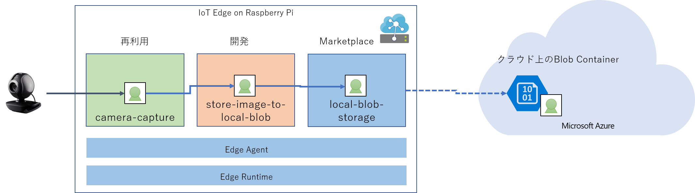

# AzureIoTBlobOnEdgeSample 
Azure IoT Edge で、デバイスに搭載されたカメラで動画をとりこみ、指定された時間間隔で、デバイスローカルの Blob on Edge に画像を格納し、Azure 上の Blob Containerに画像をアップロードする。 
 
camera-capture は、[https://github.com/ms-iotkithol-jp/Custom-vision-service-iot-edge-raspberry-pi](https://github.com/ms-iotkithol-jp/Custom-vision-service-iot-edge-raspberry-pi) を流用。 
local-blob-storage は、Azure Marketplace から公開されているモジュールを利用。  
store-image-to-local-blob は、このリポジトリの、UploadCameraImageEdgeToCloud/modules/StoreImageToLocalBlob にソースコードと Module Image の Buildが格納されている。 

## 動かし方 
VS Code で UploadCameraImageToCloud を開く  
UploadCameraImageEdgeToCLoud/.env に各自のAzure Container Registry のアクセス情報を設定  
deployment.template.json に各自の設定を追加  
Build & Deploy 

以上！